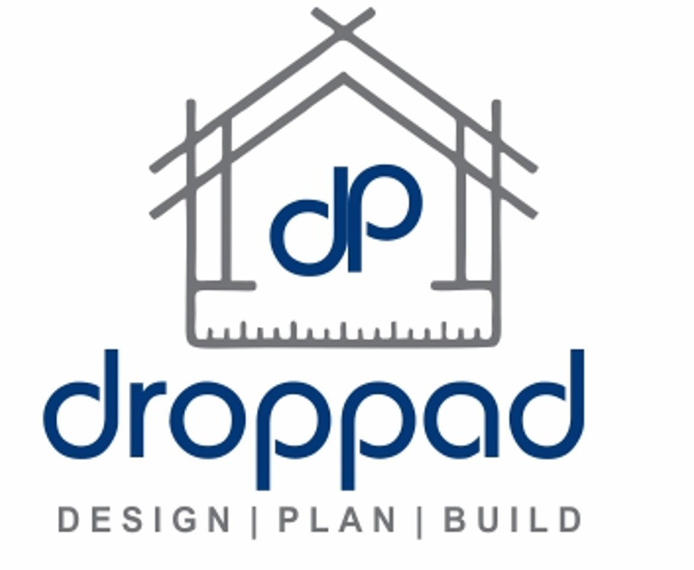

# Droppad - Architectural Design Services



**Design | Plan | Build**

Professional architectural services specialising in loft conversions, house extensions, and structural drawings & calculations across London & Home Counties.

## 🏗️ Services

- **Loft Conversions** - Transform unused loft space into valuable living areas
- **House Extensions** - Thoughtful designs that blend with your existing property  
- **Structural Calculations** - Comprehensive drawings and calculations for building regulations
- **Planning Applications** - Complete application preparation and submission support
- **Building Regulations** - Ensuring your project meets all safety and compliance requirements

## 🌍 Areas We Cover

- Luton
- St Albans  
- Harrow
- Maida Vale

## 🚀 Website Technology

This website is built with:

- **Next.js 14** - React framework
- **TypeScript** - Type-safe development
- **Tailwind CSS** - Modern styling
- **Framer Motion** - Smooth animations
- **Radix UI** - Accessible components

## 📞 Contact

- **WhatsApp**: [Chat instantly](https://wa.me/447777347741)
- **Phone**: +44 7777 347741
- **Office**: Studio, Beadlow Road, Luton, LU4 0QY *(By appointment only)*

## 🔧 Development

```bash
# Install dependencies
npm install

# Run development server
npm run dev

# Build for production
npm run build

# Start production server
npm start
```

## 📝 Deployment

This site is optimized for deployment on:

- **Vercel** (Recommended)
- **Netlify**
- **Railway**
- **DigitalOcean App Platform**

## 📄 License

© 2024 Droppad. All rights reserved.
